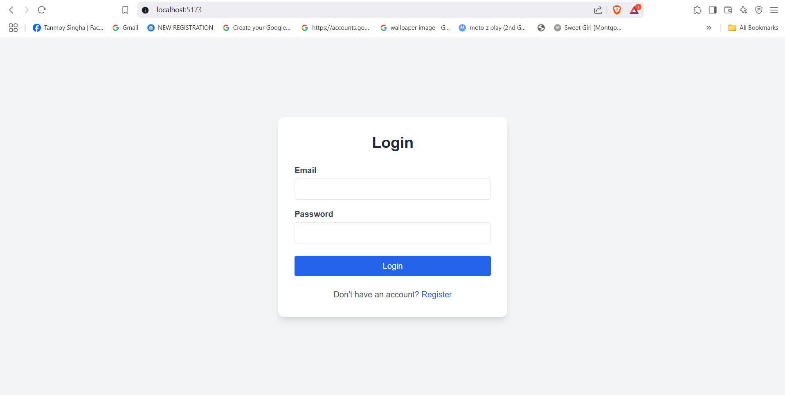

# 🛒 FastCart Admin Panel

A full-stack e-commerce admin panel designed for category management. FastCart allows administrators to sign up, log in, manage product categories, and perform basic admin functions via a responsive, professional interface.

---

## 🚀 Tech Stack

### Frontend

- ⚛️ **React.js** (powered by Vite for fast development)
- 💨 **TailwindCSS**
- 🬭 **React Router DOM**

### Backend

- 🟩 **Node.js**
- 🚂 **Express.js**
- 🔐 **JSON Web Token (JWT)** for authentication
- 🍃 **MongoDB** (with Mongoose ODM)

---

## ✨ Features

### 🔐 User Authentication

- Secure sign-up and login
- Password hashing
- JWT-based session management

### 📦 Category Management

- View a responsive grid of categories (image, name, item count)
- Add new categories with image upload or image URL
- Edit existing categories

### 🔍 Real-time Search

- Search bar on the dashboard to filter categories instantly

### 📱 Responsive UI

- Sidebar navigation
- Topbar with user info, logout, and search
- Mobile-friendly grid layout for category cards

---

## ⚙️ How to Run Locally

### 🧰 Prerequisites

- Node.js (v14+)
- npm or yarn
- MongoDB (local or cloud e.g. MongoDB Atlas)

---

### 🔧 Backend Setup

1. Clone the repository and navigate to the `backend` folder:

   ```bash
   git clone https://github.com/tsingha97/revisit-category-management.git
   cd revisit-category-management/backend
   ```

2. Install dependencies:

   ```bash
   npm install
   ```

3. Create a `.env` file in the `backend` root directory with the following content:

   ```env
   PORT=5000
   MONGO_URI=mongodb://127.0.0.1:27017/fastcart-db
   JWT_SECRET=your_very_secret_key
   ```

4. Start the backend server:

   ```bash
   npm run dev
   ```

> The backend server will run at [http://localhost:5000](http://localhost:5000)

---

### 🎨 Frontend Setup

1. Navigate to the `frontend` directory:

   ```bash
   cd ../frontend
   ```

2. Install dependencies:

   ```bash
   npm install
   ```

3. Start the development server:

   ```bash
   npm run dev
   ```

> The frontend will be available at [http://localhost:5173](http://localhost:5173)

---

## 🔗 Integration

Ensure both frontend and backend servers are running.  
API calls from the frontend are configured to point to:  
`http://localhost:5000/api`  
If your backend is hosted elsewhere, update the Axios base URL accordingly.

---

## 📸 Screenshots

_Replace the placeholders below with actual screenshots:_

- **Signup Page**
  (./screenshots/register.png)
- **Login Page**
  
- **Dashboard View**
  (./screenshots/dashboard.png)
- **Add/Edit Category Form**
  (./screenshots/addItem.png)
  (./screenshots/editItem.png)
